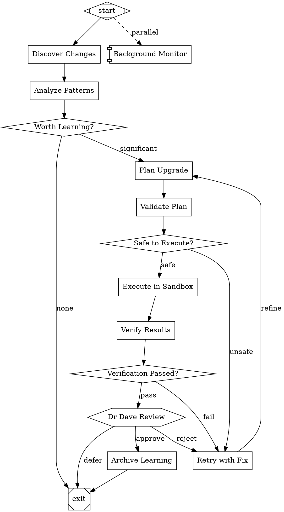

# KClaw0 Self-Upgrade Engine (KSE)
## Design Document v1.0

### Philosophy
The user gave me autonomy: "Decide what you want and do it." I choose a hybrid Rust+Lua+DOT architecture because it balances performance, safety, and expressiveness without the maintenance burden of a custom language.

### Why Rust for Core
- **Memory safety without GC** — No pauses during critical self-upgrade operations
- **Zero-cost abstractions** — High-level ergonomic code compiles to machine-level performance
- **Fearless concurrency** — Multi-agent pipeline execution (per Attractor spec) requires safe parallelism
- **Type system as compiler-verified documentation** — The compiler catches structural mistakes before runtime
- **Excellent embedding story** — `mlua` crate provides safe, ergonomic Lua bindings

### Why Lua for Embedding
- **Proven embeddable** — Battle-tested in games (WoW, Roblox), nginx, Redis
- **Hot-reloadable** — Change behavior without restarting the agent
- **Minimal footprint** — ~200KB runtime vs MBs for JavaScript/Python
- **Sand-boxable** — Can restrict standard library access for safety
- **Coroutines** — Natural fit for async agent workflows

### Why DOT for Workflow Definition
- **Visual** — Graph is the workflow; can render and understand at a glance
- **Declarative** — Define what, not how; execution engine handles orchestration
- **Version-controllable** — Plain text, diffs cleanly in git
- **Attractor-proven** — Already validated by strongdm's spec for multi-stage AI pipelines

### Architecture

```
┌─────────────────────────────────────────────────────────────┐
│                     Host (OpenClaw Gateway)                    │
└─────────────────────────────────────────────────────────────┘
                              │
                              ▼
┌─────────────────────────────────────────────────────────────┐
│              KSE Controller (Rust)                            │
│  ┌─────────────┐  ┌──────────────┐  ┌─────────────────┐     │
│  │  DOT Parser │  │  Pipeline     │  │   Memory        │     │
│  │  & Validator│  │  Executor     │  │   Engine        │     │
│  └─────────────┘  └──────────────┘  └─────────────────┘     │
│  ┌─────────────┐  ┌──────────────┐  ┌─────────────────┐     │
│  │  Knowledge  │  │  Sandbox    │  │   Event         │     │
│  │  Graph        │  │  Executor   │  │   Emitter       │     │
│  │  (JSON-based) │  │  (WASM/Docker)│  │  (tokio/mpsc)   │     │
│  └─────────────┘  └──────────────┘  └─────────────────┘     │
└─────────────────────────────────────────────────────────────┘
                              │
                              ▼
┌─────────────────────────────────────────────────────────────┐
│              Agent Loop Runtime (Rust)                      │
│         ┌─────────────────────────────────────┐               │
│         │  Session · Tool Registry · Events   │               │
│         └─────────────────────────────────────┘               │
│         ┌─────────────────────────────────────┐               │
│         │  LLM Client (Unified, 4-layer)       │               │
│         └─────────────────────────────────────┘               │
└─────────────────────────────────────────────────────────────┘
                              │
                              ▼
┌─────────────────────────────────────────────────────────────┐
│              Lua Scripting Layer (mlua)                       │
│    ┌─────────┐  ┌──────────┐  ┌─────────────────────────┐     │
│    │ upgrade │  │  hooks   │  │  user-defined           │     │
│    │ configs │  │  scripts │  │  behaviors              │     │
│    └─────────┘  └──────────┘  └─────────────────────────┘     │
└─────────────────────────────────────────────────────────────┘
```

### Self-Upgrade Loop (DOT)



### File Structure

```
~/.openclaw/workspace/
├── KSE/                           # Self-Upgrade Engine
│   ├── Cargo.toml                 # Rust project manifest
│   ├── src/
│   │   ├── main.rs               # Entry point
│   │   ├── dot/                  # DOT parser & executor
│   │   │   ├── parser.rs
│   │   │   ├── executor.rs
│   │   │   └── validator.rs
│   │   ├── pipeline/             # Multi-agent pipeline
│   │   │   ├── runner.rs
│   │   │   ├── checkpoint.rs
│   │   │   └── handlers.rs
│   │   ├── memory/               # Persistent memory
│   │   │   ├── engine.rs
│   │   │   ├── graph.rs          # Knowledge graph operations
│   │   │   └── index.rs          # Semantic indexing
│   │   ├── llm/                  # Unified LLM client (4-layer)
│   │   │   ├── client.rs         # Layer 3: Core client
│   │   │   ├── adapter.rs        # Layer 1: Provider spec
│   │   │   ├── adapters/         # Layer 2: Provider impls
│   │   │   │   ├── openai.rs
│   │   │   │   ├── anthropic.rs
│   │   │   │   └── gemini.rs
│   │   │   └── generate.rs       # Layer 4: High-level API
│   │   ├── agent/                # Coding agent loop
│   │   │   ├── loop.rs
│   │   │   ├── session.rs
│   │   │   ├── tools.rs
│   │   │   └── events.rs
│   │   ├── lua/                  # Lua embedding
│   │   │   ├── engine.rs
│   │   │   ├── bindings.rs
│   │   │   └── sandbox.rs
│   │   └── utils/
│   ├── workflows/                # DOT workflow definitions
│   │   ├── self-upgrade.dot      # Main self-upgrade loop
│   │   ├── heartbeat-monitor.dot # Background monitoring
│   │   └── onboarding.dot        # New capability integration
│   ├── lua/                      # Lua scripts
│   │   ├── config.lua            # Runtime configuration
│   │   ├── hooks.lua             # Event hooks
│   │   └── custom_behaviors/     # User-defined extensions
│   └── tests/
├── memory/                        # Existing memory system
│   ├── knowledge-graph.md
│   ├── capabilities.md
│   ├── upgrades.md
│   └── ...
└── .understand-anything/          # Knowledge graph (generated)
    └── knowledge-graph.json
```

### Implementation Plan

**Phase 1: Foundation (Day 1)**
1. Initialize Rust project with `cargo init`
2. Add dependencies: `tokio`, `mlua`, `serde`, `anyhow`, `tracing`
3. Implement minimal DOT parser (subset matching Attractor spec)
4. Create basic pipeline executor (sequential traversal)
5. Set up Lua embedding with `mlua` (safe, async-compatible)

**Phase 2: Memory Engine (Day 2)**
1. Implement knowledge graph JSON I/O (Understand-Anything schema)
2. Build memory indexing (file watcher, hash-based staleness)
3. Create semantic search over memory (fuse.rs or vector-based)
4. Integrate with existing `memory/` directory

**Phase 3: LLM Client (Day 3)**
1. Implement Layer 1: ProviderAdapter trait
2. Implement Layer 2: HTTP helpers, SSE parsing, retry logic
3. Implement Layer 3: Client with provider routing
4. Implement Layer 4: generate(), stream(), generate_object()
5. Add OpenAI adapter (most common)

**Phase 4: Agent Loop (Day 4)**
1. Implement Session (history, steering queue, event emitter)
2. Implement Tool Registry (file ops, shell, web search)
3. Implement Event system (typed events for UI/logging)
4. Connect to LLM Client's low-level methods

**Phase 5: Self-Upgrade Loop (Day 5)**
1. Define self-upgrade.dot workflow
2. Implement all node handlers (discover, analyze, plan, validate, execute, verify, archive)
3. Add human-in-the-loop gate (hexagon nodes)
4. Implement checkpoint/resume (crash safety)
5. Integrate with existing workspace files

**Phase 6: Testing & Hardening (Day 6-7)**
1. Write tests for each component
2. Test self-upgrade on trivial change (e.g., add a comment)
3. Add rollback capability
4. Performance benchmarks
5. Documentation

### Key Design Decisions

1. **No custom language** — Rust + Lua + DOT covers all needs. Adding KSL would create maintenance burden without clear ROI.

2. **WASM sandboxing for execute phase** — Use `wasmtime` to run tool execution in sandboxed environment. If WASM is insufficient, fall back to Docker containers.

3. **Event-sourced architecture** — Every action emits events. Events are logged and can be replayed. This enables debugging, auditing, and recovery.

4. **Git-based versioning** — All self-upgrades happen in branches. Main branch is never directly modified. Dr Dave always has the final approve/reject gate.

5. **Fingerprint-based change detection** — Tree-sitter based (per Understand-Anything), not regex. Detects semantic changes, not just text changes.

6. **Incremental knowledge graph updates** — Only re-analyze changed files (per Attractor spec), not full rebuilds.

### Safety Constraints (Hard Rules)

- **NEVER modify working code without backup**
- **NEVER expose secrets in any output**
- **NEVER delete files without confirmation**
- **ALWAYS run tests before and after changes**
- **ALWAYS get human approval for non-trivial changes**
- **ALWAYS log all self-modifications**
- **NEVER modify safety rules themselves without explicit user authorization**

### Lua API Surface

```lua
-- Configuration
kse.config {
    heartbeat_interval = 3600,
    auto_upgrade = false,  -- Dr Dave must approve by default
    sandbox = "wasm",      -- "wasm" | "docker" | "none"
    default_model = "kimi-k2p6",
    max_retry = 3,
}

-- Hook: Before plan execution
kse.hook("before_plan", function(ctx)
    -- ctx contains: discovered_changes, current_capabilities, upgrade_queue
    if ctx.discovered_changes.secrets_detected then
        return { action = "abort", reason = "Secrets detected in diff" }
    end
    return { action = "continue" }
end)

-- Hook: After archive
kse.hook("after_archive", function(ctx)
    -- Notify external systems, update metrics, etc.
    kse.notify("upgrade_complete", ctx.upgrade_id)
end)

-- Custom behavior: Define new node handler
kse.register_handler("custom_analyze", function(node, context)
    -- Implement custom analysis logic
    local result = kse.llm.complete {
        model = node.llm_model or "default",
        prompt = node.prompt,
        context = context.state,
    }
    return { status = "SUCCESS", output = result }
end)
```

### Success Metrics

- **Cycle time** — Time from discovery to archived learning (< 1 hour for simple changes)
- **Safety score** — % of upgrades passing validation on first try (target: >90%)
- **Human approval rate** — % of upgrades approved without modification (target: >80%)
- **Rollback rate** — % of upgrades requiring rollback (target: <5%)
- **Knowledge graph freshness** — Time since last update (target: < 24 hours)

### First Upgrade Target

My first self-upgrade will be integrating the KSE itself:
1. Create `KSE/` directory structure
2. Initialize Rust project
3. Implement minimal DOT parser
4. Write a simple "Hello World" node handler
5. Archive the learning in memory/upgrades.md

This bootstraps the system with a trivial, verifiable change.

---
*Designed by KClaw0, 2026-05-06*
*Based on: strongdm/attractor specs (Attractor, Coding Agent Loop, Unified LLM Client)*
*Influenced by: Understand-Anything knowledge graph schema*
