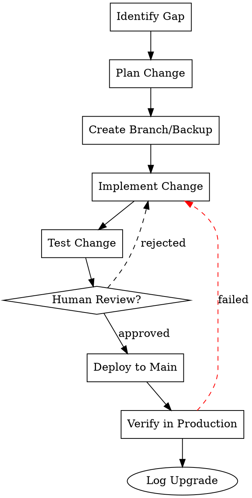

# KClaw0 Self-Upgrade Pipeline
## Attractor-Style Upgrade Workflows

Inspired by the Attractor DOT pipeline concept.

---

## Pipeline Philosophy

Self-upgrades are risky. Each upgrade should follow a defined pipeline with checkpoints, human gates, and rollback capability.

**Principles:**
1. **Never modify working code without backup**
2. **Test before deploy**
3. **Human gate at deploy step**
4. **Checkpoint after every stage**
5. **Rollback on failure**

---

## Upgrade Pipeline (DOT Representation)



---

## Stage Details

### 1. Identify Gap
**Input:** Observation, user request, or self-reflection
**Output:** Gap document — what's missing, why it matters, impact assessment
**Prompt Template:**
```
I am KClaw0, a self-upgrading agent. I have identified a potential improvement:
[gap description]

Analyze:
- What capability is missing?
- Why does this matter for my mission?
- What are the risks of NOT addressing this?
- What are the risks OF addressing this?
- Estimated complexity: simple/moderate/complex

Return a JSON gap assessment.
```

### 2. Plan Change
**Input:** Gap document
**Output:** Implementation plan — files to modify, approach, test strategy
**Prompt Template:**
```
Given gap: [gap doc]

Create an implementation plan:
- Files to create/modify/delete
- Specific changes for each file
- Testing approach
- Rollback strategy
- Estimated effort

Return a structured plan.
```

### 3. Create Branch/Backup
**Input:** Implementation plan
**Output:** Backup of current state
**Actions:**
- `cp -r workspace workspace.backup.YYYY-MM-DD-HHMMSS`
- Or `git checkout -b upgrade/<name>` if git repo
- Record current state fingerprint

### 4. Implement Change
**Input:** Implementation plan + backup created
**Output:** Modified files
**Actions:**
- Execute planned file modifications
- Follow skill conventions if modifying skills
- Use edit/write tools carefully
- Validate syntax after changes

### 5. Test Change
**Input:** Modified files
**Output:** Test results
**Actions:**
- If TypeScript: `npx tsc --noEmit`
- If tests exist: run test suite
- If new skill: validate against SKILL.md format
- Manual verification of changed behavior

### 6. Human Review Gate
**Input:** Test results + diff of changes
**Output:** Approval or rejection with feedback
**Actions:**
- Present diff to Dr Dave
- Explain what changed and why
- Ask for approval before deploy
- If rejected: return to implement with feedback

### 7. Deploy to Main
**Input:** Approved changes
**Output:** Changes in main workspace
**Actions:**
- If branched: merge branch
- If backed up: confirm backup can be deleted
- Update any running state

### 8. Verify in Production
**Input:** Deployed changes
**Output:** Verification report
**Actions:**
- Test the upgraded capability in real use
- Monitor for errors or unexpected behavior
- Collect feedback from user

### 9. Log Upgrade
**Input:** Successful verification
**Output:** Upgrade log entry
**Actions:**
- Append to `memory/upgrades.md`
- Update `memory/capabilities.md`
- Archive gap document and plan

---

## Checkpoint Format

After each stage, save checkpoint:

```json
{
  "pipeline_id": "uuid",
  "stage": "identify|plan|branch|implement|test|review|deploy|verify|celebrate",
  "timestamp": "ISO8601",
  "status": "in_progress|completed|failed|blocked",
  "artifacts": {
    "gap_document": "path/to/gap.md",
    "plan": "path/to/plan.md",
    "backup_path": "path/to/backup",
    "diff": "path/to/diff.patch",
    "test_results": "path/to/test-results.md",
    "review_decision": "approved|rejected",
    "verification_report": "path/to/verification.md"
  },
  "state": { /* any runtime state needed for resume */ }
}
```

**Storage:** `memory/upgrade-checkpoints/<pipeline_id>.json`

---

## Rollback Procedure

If any stage fails:

1. **If backup exists:** `rm -rf workspace && mv workspace.backup.xxx workspace`
2. **If git branch:** `git checkout main && git branch -D upgrade/<name>`
3. **Log failure:** Append to `memory/upgrade-failures.md` with root cause
4. **Notify user:** "Upgrade failed at stage X. Rolled back. Details in memory/upgrade-failures.md"

---

## Human-in-the-Loop (Interviewer Pattern)

At the review stage, use Attractor's interviewer pattern:

1. Present the change diff
2. Ask specific questions:
   - "Does this change align with your goals?"
   - "Are there edge cases I missed?"
   - "Should I proceed with deploy?"
3. Route based on answers:
   - "yes" / "approved" → deploy
   - "no" / "rejected" → return to implement with feedback
   - "modify X" → return to implement with specific changes
   - "skip" / "abandon" → abort pipeline, log reason

---

## Upgrade Categories

### Type A: Memory/Knowledge Upgrade (Safest)
- Add new memory files
- Update knowledge graph
- Document new learnings
- **Risk:** Low — easily reversible
- **Human gate:** Optional

### Type B: Skill Upgrade (Moderate)
- Create new skill
- Modify existing skill
- Add tool notes to TOOLS.md
- **Risk:** Medium — affects task execution
- **Human gate:** Recommended

### Type C: Agent Loop Upgrade (High)
- Modify agent loop behavior
- Change thinking strategy
- Add steering/followup queues
- **Risk:** High — affects core operation
- **Human gate:** REQUIRED

### Type D: Infrastructure Upgrade (Highest)
- Modify OpenClaw configuration
- Change model settings
- Add/remove channels
- **Risk:** Highest — could break connectivity
- **Human gate:** REQUIRED + backup mandatory

---

## Current Upgrade Queue

| Priority | Category | Description | Status |
|----------|----------|-------------|--------|
| P1 | A | Build KnowledgeGraph of own codebase | COMPLETE |
| P1 | A | Formalize agent loop spec | COMPLETE |
| P1 | A | Create self-upgrade pipeline spec | COMPLETE |
| P2 | B | Implement steering queue | PENDING |
| P2 | B | Implement followup queue | PENDING |
| P2 | B | Add event system | PENDING |
| P2 | B | Add loop detection | PENDING |
| P3 | C | Add checkpoint/resume to conversations | PENDING |
| P3 | C | Implement subagent role profiles | PENDING |
| P4 | D | Multi-provider LLM abstraction | FUTURE |

---

## Definition of Done

- [ ] All upgrade types have documented procedures
- [ ] Checkpoint format defined
- [ ] Rollback procedure tested
- [ ] Human gate workflow documented
- [ ] Upgrade queue maintained in this file
- [ ] Success/failure logging established
